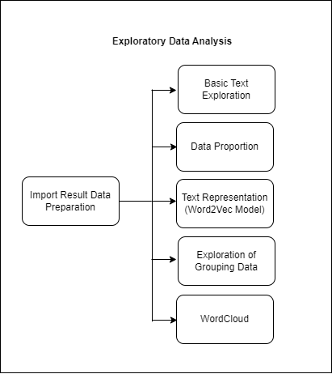
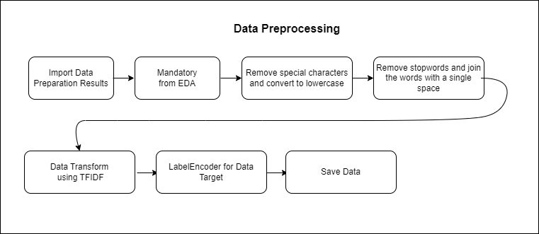
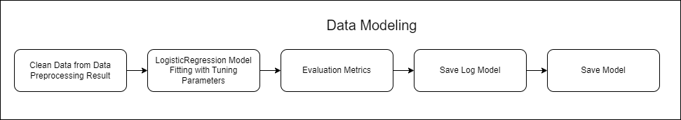
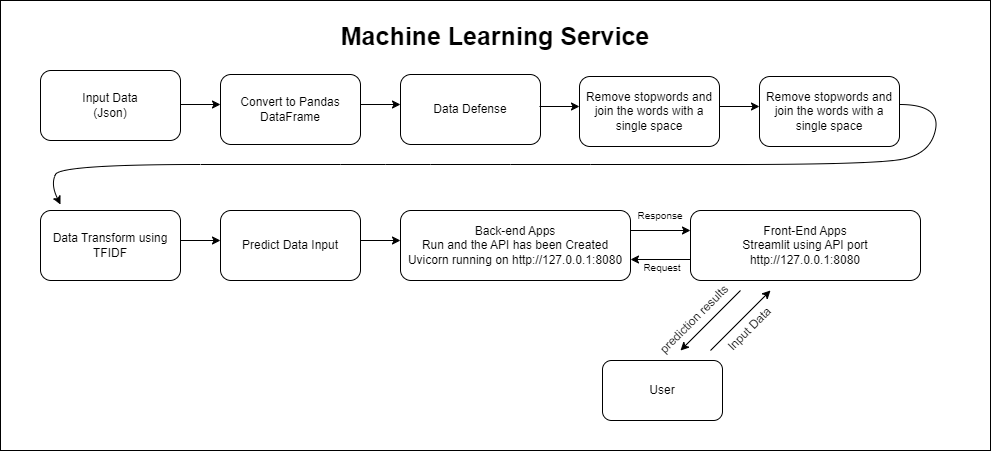
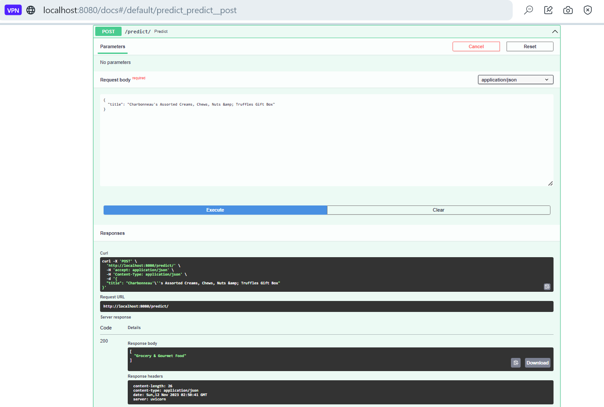
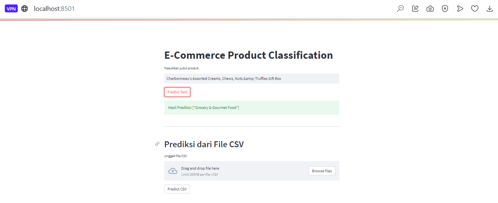
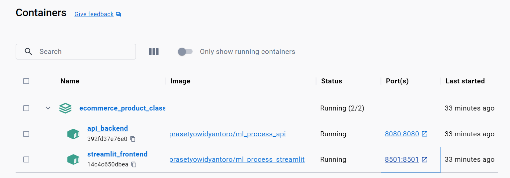
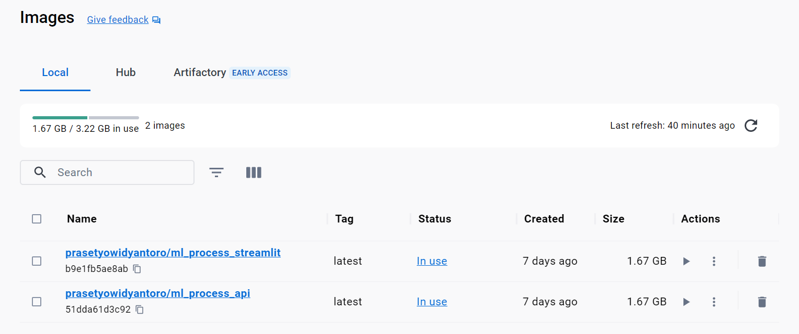

# E-Commerce Product Classification Using Multi-class Classification

- `Link Dokumentasi` : -
- `Link Medium` : https://medium.com/@prasetyow938/natural-language-processing-online-store-product-classification-using-multi-class-classification-81975d03e4a3
- `Link Youtube` : -

## Cara menjalankan Script Dilokal

### Konfigurasi Awal
- Buat satu folder untuk clone file-file yang tersedia pada laman github ini
- clone repository github ini
- instalasi virtual environment
- aktifkan virtual environment yang telah dibuat
- install requirements.txt dengan cara `pip install -r requirements.txt`
- file sudah dikonfigurasi, lanjutkan step dibawah ini sesuai dengan keinginan

## Penggunaan Docker

1. Pastikan sudah melakukan clone repository program ini
2. instalasi virtual environment
3. aktifkan virtual environment yang telah dibuat
4. install requirements.txt dengan cara pip install -r requirements.txt
5. pastikan docker sudah diaktifkan dan dalam kondisi login
6. lalu, jalankan melalui terminal yang sudah diaktifkan virtual environment dengan script berikut docker `compose up -d --build`
7. Machine Learning Service “Online Store Product Classification Using Multi-class Classification” siap untuk digunakan.
8. API : http://localhost:8080/docs dan UI Front End (Streamlit) : http://localhost:8501

## End to End Machine Learning Process

Prosesnya akan melakukan data preparation, EDA, Data Preprocessing, Data Modeling hingga Machine Learning Service menggunakan API, Streamlit dengan Docker.

### Data Preparation

**Gambar Arsitektur Data Preparation**

Data preparation diawali dengan read raw data, dilanjut dengan pendefinisian kolom kolom yang akan diproses, tak lupa melalui data validation terkhusus untuk melakukan pengecekan tipe data, dan dilanjut data splitting untuk memisahkan antara data train, data valid dan data test dan akhirnya data akan disave sebelum dilanjutkan ke tahap data preprocessing.

Data yang digunakan dalam analisis ini mencakup informasi tentang nama produk dan kategori produk yang diambil dari dataset berikut

#### Dataset Definition
Sumber Data: [Predict Categories of Items using NLP](https://www.kaggle.com/datasets/shivam1298/predict-categories-of-items-using-nlp)

Dataset ini terdiri dari 20.188 baris data dengan dua kolom utama:

- `title`: Kolom ini berisi nama produk yang dijual di platform e-commerce.
- `category`: Kolom ini berisi kategori atau klasifikasi produk yang sesuai dengan produk tersebut.

### Exploratory Data Analysis (EDA)

**Gambar Arsitektur Exploratory Data Analysis (EDA)**

Selanjutnya masuk ketahap EDA (Exploratory Data Analysis), ditahap ini melakukan eksplorasi terkait dengan mengenal data lebih jauh, prosesnya antara lain, yang pertama, akan melakukan Basic Text Exploration yakni Melihat “title” dengan nama terpanjang, Melihat “title” dengan nama terpendek, Melihat produk dengan judul yang mengandung karakteristik tertentu, Mencari baris yang mengandung tanda baca atau karakter khusus, Cari baris dengan multiple spaces pada kolom title. Kedua, Data Proportion dengan melakukan Cek Proporsi Data baik secara jumlah dan persentase label target. Ketiga, Text Representation, dengan Eksplorasi Awal Pembangunan Model Word2Vec untuk Representasi Kata pada Data Teks. Keempat, Exploration of Grouping Data yakni dengan Eksplorasi Awal Pengelompokan Data Teks dengan K-Means Menggunakan Ekstraksi Fitur TF-IDF dan Visualisasi dengan PCA. Terakhir adalah melakukan WordCloud.

### Data Preprocessing

**Gambar Data Preprocessing**

Saat ini masuk ke tahap Data Preprocessing, tahap pertama yang akan dilakukan setelah melakukan read data hasil dari data prepration adalah melakukan eksekusi data pasca EDA (Mandatory from EDA), yakni Remove special characters and convert to lowercase dan Remove stopwords and join the words with a single space, setelah itu dilanjut dengan transformasi data dengan menggunakan TFIDF dengan tujuan memberikan bobot pada kata-kata yang muncul secara unik dan penting dalam suatu dokumen, sehingga dapat membedakan dokumen satu dengan yang lain. Tak lupa melakukan label encoder untuk data target dengan Electronics -> 0, Grocery & Gourmet Food -> 1, Home & Kitchen -> 2, Industrial & Scientific -> 3, Office Products -> 4, Tools & Home Improvement -> 5. Setelah proses tersebut selesai, maka data akan disave.

### Data Modeling

**Gambar Arsitektur Data Modeling**

## Machine Learning Services

**Arsitektur Machine Learning Services**

Dalam prosesnya machine learning service diawali dengan user yang melakukan input data, lalu data yang telah diinput dilakukan convert ke pandas dataframe dan melalui proses data defense agar data yang di input sesuai dengan model yang telah ditrain. Selanjutnya, Remove special characters and convert to lowercase dan Remove stopwords and join the words with a single space. Data yang telah dilakukan proses cleansing dilanjutkan dengan transformasi dengan TFIDF dan akhirnya dilakukan prediksi dari model yang telah kita save pada data modeling.

Dalam melakukan prediksi, user melakukan input data di laman streamlit yang merupakan front end dari aplikasi. Setelah user melakukan klik pada “Predict”, data tersebut melakukan request ke back-end, dan back end mengembalikan atau merespon (response) dalam bentuk hasil prediksi ke user.

Framework API yang digunakan dalam proses Machine Learning Service adalah FASTAPI, dan Front End menggunakan Streamlit

**Prediksi menggunakan API dengan menggunakan FASTAPI**

Selanjutnya, setelah melalui beberapa proses dan model telah di save akan dilanjutkan pada deployment dengan menggunakan API dan Streamlit gambar dibawah ini merupakan contoh mengakses menggunakan ML Services melalui FAST API Swagger UI

Berikut contoh input data yang digunakan untuk mengakses API

Agar lebih ramah dalam menggunakannya dan tampilannya lebih powerfull, user disuguhkan dengan apps sederhana yang dibangun dengan menggunakan streamlit services, berikut contoh penggunaannya

**Prediksi menggunakan form yang telah disediakan**

**Prediksi menggunakan file CSV**

## Menggunakan Docker Container

Ketika service ingin dijalankan bersamaan, maka kita perlu menggunakan tools yang mendukung hal tersebut, salah satunya dapat menggunakan docker berikut contoh service sederhana yang dijalankan dengan bantuan docker

Berikut hasil input service ke docker container

Berikut hasil input service ke docker Image

## Referensi

- https://www.projectpro.io/article/multi-class-classification-python-example/547?source=post_page-----81975d03e4a3--------------------------------
- https://towardsdatascience.com/comprehensive-guide-to-multiclass-classification-with-sklearn-127cc500f362?source=post_page-----81975d03e4a3--------------------------------
- https://www.kaggle.com/code/satishgunjal/binary-multiclass-classification-using-sklearn?source=post_page-----81975d03e4a3--------------------------------#Train-and-Evaluate-a-Binary-Classification-Model
- https://builtin.com/machine-learning/multiclass-classification
- Iskandar Zulkarnain Maulana Putra, T., Farhan Bukhori, A., Ilmu Pengetahuan Alam, dan, & Gadjah Mada, U. (2022). Model Klasifikasi Berbasis Multiclass Classification dengan Kombinasi Indobert Embedding dan Long Short-Term Memory untuk Tweet Berbahasa Indonesia (Classification Model Based on Multiclass Classification with a Combination of Indobert Embedding and Long Short-Term Memory for Indonesian-language Tweets). Jurnal Ilmu Siber Dan Teknologi Digital (JISTED), 1(1), 1–28. https://doi.org/10.35912/jisted.v1i1.1509
- Nugroho, W. H., Handoyo, S., Akri, Y. J., & Sulistyono, A. D. (2022). Building Multiclass Classification Model of Logistic Regression and Decision Tree Using the Chi-Square Test for Variable Selection Method. Journal of Hunan University Natural Sciences, 49(4), 172–181. https://doi.org/10.55463/issn.1674-2974.49.4.17
- Rabbimov, I. M., & Kobilov, S. S. (2020). Multi-Class Text Classification of Uzbek News Articles using Machine Learning. Journal of Physics: Conference Series, 1546(1). https://doi.org/10.1088/1742-6596/1546/1/012097
