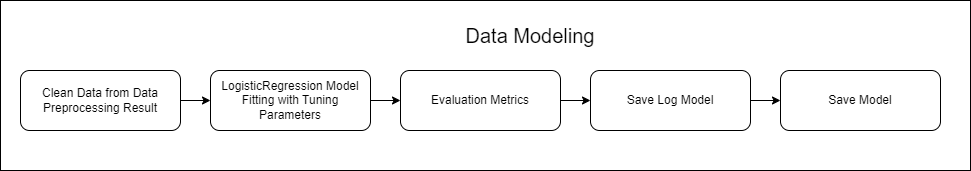
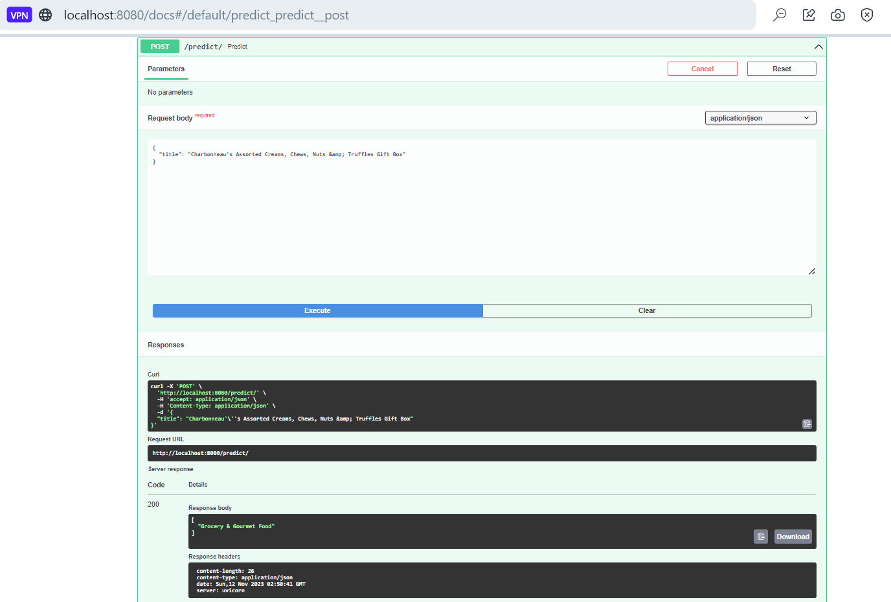
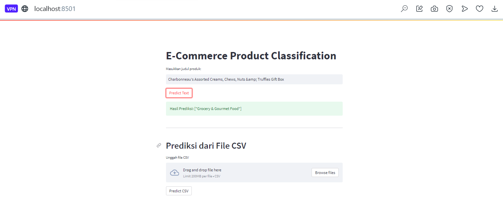
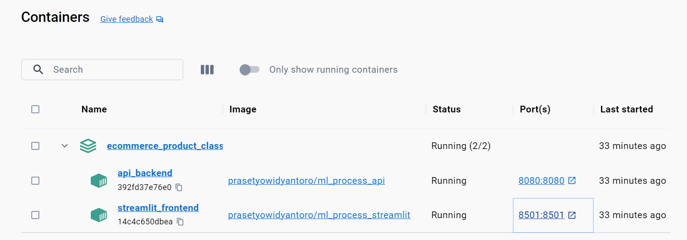
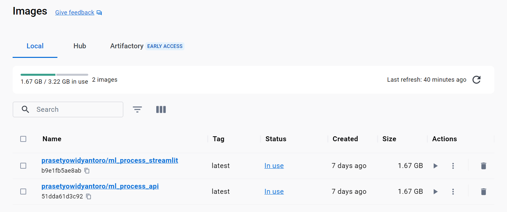

#  E-Commerce Product Classification Using Multi-class Classification

## Business Problem

Di era online store yang terus berkembang, pengklasifikasian produk secara otomatis merupakan tantangan yang serius. Setiap produk di platform online harus ditempatkan dalam kategori yang sesuai dengan karakteristiknya. Untuk mengatasi permasalahan ini, perlu mengembangkan solusi yang memanfaatkan pemrosesan bahasa alami (Natural Language Processing — NLP).

Tantangan utama yang dihadapi adalah menciptakan model multi-class classification yang dapat memahami deskripsi produk dan mengkategorikannya dengan benar. Keakuratan dalam mengklasifikasikan produk ke dalam kategori yang sesuai sangat penting untuk meningkatkan pengalaman pengguna.

Dalam konteks ini, kesalahan pengklasifikasian produk ke dalam kategori yang salah bisa mengakibatkan ketidakpuasan pelanggan. Namun, peningkatan jumlah False Positive (produk yang salah diklasifikasikan ke dalam kategori tertentu) juga harus dihindari sebisa mungkin.

Dengan fokus pada multi-class classification menggunakan NLP, tujuannya adalah menciptakan sistem yang dapat mengkategorikan produk dengan akurat. Hal ini akan membantu meningkatkan efisiensi operasional, meningkatkan pengalaman pelanggan, dan mengoptimalkan penjualan di platform online store. Dengan kata lain, program ini berusaha untuk memastikan bahwa setiap produk ditempatkan dalam kategori yang paling sesuai berdasarkan titlenya, sehingga pembeli dapat menemukan apa yang mereka cari dengan lebih mudah.

## Business Objective

Dalam rangka meningkatkan pengalaman pelanggan dan efisiensi operasional di platform online store, objektif bisnis pada program ini antara lain:

1. Peningkatan Akurasi Klasifikasi: Tujuan utama program ini adalah mengembangkan model klasifikasi produk berbasis pemrosesan bahasa alami (NLP) yang mampu mengkategorikan setiap produk dengan tingkat akurasi yang tinggi. Dengan demikian, program ini akan meminimalkan kesalahan dalam menempatkan produk dalam kategori yang sesuai.

2. Optimasi Pengalaman Pengguna: Program ini berusaha untuk memberikan pengalaman belanja online yang lebih baik bagi pelanggan. Dengan model klasifikasi yang akurat, produk dapat ditempatkan dalam kategori yang benar, memudahkan pembeli dalam menemukan produk yang mereka cari.

3. Penghematan Waktu dan Sumber Daya: Dengan otomatisasi klasifikasi produk, program ini diharapkan bisa menghemat waktu dan sumber daya yang sebelumnya digunakan untuk mengelola pengkategorian produk secara manual.

4. Peningkatan Penjualan: Dengan produk yang lebih mudah ditemukan oleh pembeli, program ini diharapkan berguna untuk mengoptimalkan penjualan di online store. Produk yang sesuai dengan preferensi pembeli akan lebih mudah dijelajahi dan ditemukan, meningkatkan potensi konversi penjualan.

## Machine Learning Solution

Solusi pemrosesan bahasa alami (NLP) untuk proyek Klasifikasi Produk Online Store ini difokuskan pada pengembangan model klasifikasi produk yang dapat memprediksi kategori yang paling sesuai berdasarkan deskripsi atau judul produk yang diunggah. Dalam konteks ini, proyek ini menggunakan algoritme Machine Learning Logistic Regression sebagai inti solusi.

Program ini dimulai dengan langkah-langkah penting seperti pemrosesan data dan feature engineering. Data produk yang masuk harus dipersiapkan agar sesuai untuk proses klasifikasi. Ini melibatkan membersihkan teks dari karakter khusus, mengonversi huruf menjadi huruf kecil, dan menghilangkan kata-kata yang tidak relevan. Selanjutnya, hal ini menghasilkan fitur-fitur yang relevan dari teks produk, seperti penggunaan teknik vectorization (misalnya, TF-IDF) untuk mengubah teks menjadi representasi angka yang dapat digunakan oleh model.

Program ini memanfaatkan model klasifikasi Logistic Regression. Model ini ditrain dengan menggunakan data training yang telah dipersiapkan. Logistic Regression adalah pilihan yang baik karena kemampuannya dalam menangani masalah klasifikasi multi-kelas, yang sesuai dengan kebutuhan dalam mengkategorikan produk ke dalam beberapa kategori yang berbeda.

Setelah model Logistic Regression ditrain, program ini dapat digunakan untuk memprediksi kategori yang paling sesuai untuk setiap produk yang diunggah ke platform toko online. Misalnya, program ini dapat memprediksi bahwa produk tersebut termasuk dalam kategori Electronics -> 0, Grocery & Gourmet Food -> 1, Home & Kitchen -> 2, Industrial & Scientific -> 3, Office Products -> 4, Tools & Home Improvement -> 5 tergantung pada deskripsi atau judul produk yang diunggah.

Selain itu, program ini juga mencakup elemen perbaikan dan monitoring berkelanjutan. Model Logistic Regression harus dimonitor secara berkala untuk memastikan bahwa klasifikasi produk tetap akurat dan relevan seiring dengan perubahan dalam preferensi konsumen dan pasar. Pemantauan kinerja model akan memungkinkan untuk mengambil tindakan yang sesuai jika ada penurunan dalam akurasi klasifikasi.

## Machine Learning Metrics

`Prediksi Klasifikasi Produk Toko Online menggunakan Multi-class Classification` adalah alat analisis data yang digunakan untuk mengidentifikasi produk dalam toko online berdasarkan deskripsi produk yang telah diberikan. Kumpulan data ini berisi informasi tentang produk di online store, dan variabel targetnya adalah variabel kelas (kategori produk) yang mencerminkan kelas produk mana yang sesuai. Variabel fitur digunakan untuk memproses dan memprediksi kategori produk yang paling relevan untuk setiap deskripsi produk.

Pada kasus ini, fokus utama adalah pada metrik bisnis, yaitu `recall`. `Recall` dalam konteks ini lebih mengutamakan kemampuan model untuk memprediksi kategori produk yang benar daripada produk yang salah. Ini berarti model akan berupaya meminimalkan jumlah produk yang sebenarnya termasuk dalam kategori tertentu namun diprediksi sebagai kategori lain (False Negative), dan meningkatkan jumlah produk yang diprediksi dengan benar ke dalam kategori yang sesuai (True Positive). Meskipun hal ini dapat mengurangi jumlah produk yang benar-benar tidak masuk dalam kategori tertentu yang diprediksi sebagai masuk (False Positive), fokus utama tetap pada memastikan bahwa produk yang benar-benar masuk dalam kategori tersebut terdeteksi dengan baik.

Dengan demikian, model NLP yang digunakan dalam tugas klasifikasi produk online store akan dioptimalkan untuk mencapai nilai recall yang tinggi, sehingga produk diklasifikasikan dengan akurasi yang lebih baik ke dalam kategori yang sesuai, mengurangi jumlah produk yang terlewatkan atau salah klasifikasi.”
    
## Literature Review

**Model Klasifikasi Berbasis Multiclass Classification dengan Kombinasi Indobert Embedding dan Long ShortTerm Memory untuk Tweet Berbahasa Indonesia (Classification Model Based on Multiclass Classification with a Combination of Indobert Embedding and Long Short-Term Memory for Indonesian-language Tweets**

Kombinasi pre-trained IndoBERT dan Long Short-Term Memory (LSTM) memberikan hasil pengklasifikasian yang lebih baik, baik pada dataset asli maupun yang telah dimodifikasi. Model IndoBERT-LSTM dengan hyperparameter terbaik (batch size 16, learning rate 2e-5, dan average pooling) mencapai F1-score 98,90% pada dataset asli dan 92,83% pada dataset dimodifikasi. Peningkatan performa IndoBERT-LSTM dari fine-tuned IndoBERT tidak terlalu signifikan. (Iskandar Zulkarnain Maulana Putra et al., 2022)

**Multi-Class Text Classification of Uzbek News Articles using Machine Learning.**

Dalam tulisan ini, klasifikasi teks multiclass untuk teks yang ditulis dalam bahasa Uzbek. Artikel-artikel dari sepuluh kategori dipilih dari edisi berita online Uzbek “Daryo”. Saat melakukan klasifikasi teks multiclass untuk dataset ini, enam algoritma pembelajaran mesin yang berbeda digunakan: Support Vetor Machine (SVM), Decision Tree (DTC), Random Forest (RF), Logistic Regression (LR), dan Naïve Bayes Multinomial (MNB). Algoritma TF-IDF dan model n-gram pada tingkat kata dan karakter digunakan sebagai metode ekstraksi fitur. Saat menentukan hiperparameter untuk klasifikasi teks, validasi silang 5-fold digunakan. Percobaan dilakukan dan akurasi tertinggi mencapai 86,88% (Rabbimov & Kobilov, 2020).

**Building Multiclass Classification Model of Logistic Regression and Decision Tree Using the Chi-Square Test for Variable Selection Method.**

Feature Selection menggunakan pendekatan filter menunjukkan bahwa semua fitur prediktor bergantung pada fitur target. Fitur prediktor yang independen satu sama lain melibatkan riwayat diabetes ibu sebelum hamil (X2), tekanan darah ayah (X3), kondisi psikologis ayah (X8), dan kualitas air minum (X10). Selain itu, fitur-fitur ini merupakan masukan model klasifikasi. Distribusi label kelas dataset tidak seimbang, di mana Kelas 0 mendominasi sekitar 70% dari contoh Kelas 0, tetapi hanya ada 0,33% atau 3 dari 900 contoh Kelas 1. Ketidakseimbangan distribusi label kelas ini dapat mengganggu perolehan model klasifikasi yang lebih baik. Model Decision Tree memiliki kinerja lebih tinggi daripada model Logistic Regression. Ukuran kinerja, termasuk Accuracy, precision, recall, dan F1-score, masing-masing adalah 90%, 89%, 90%, dan 89% untuk Logistic Regression dibandingkan dengan 91%, 90%, 91%, dan 90% untuk model Decision Tree. Selain itu, model Decision Tree dapat menunjukkan tingkat fitur penting dalam proses pemisahan saat membangun model.(Nugroho et al., 2022)

## End to End Machine Learning Process

Prosesnya akan melakukan data preparation, EDA, Data Preprocessing, Data Modeling hingga Machine Learning Service menggunakan API, Streamlit dengan Docker.

### Data Preparation

**Gambar Arsitektur Data Preparation**

Data preparation diawali dengan read raw data, dilanjut dengan pendefinisian kolom kolom yang akan diproses, tak lupa melalui data validation terkhusus untuk melakukan pengecekan tipe data, dan dilanjut data splitting untuk memisahkan antara data train, data valid dan data test dan akhirnya data akan disave sebelum dilanjutkan ke tahap data preprocessing.

Data yang digunakan dalam analisis ini mencakup informasi tentang nama produk dan kategori produk yang diambil dari dataset berikut

#### Dataset Definition
Sumber Data: [Predict Categories of Items using NLP](https://www.kaggle.com/datasets/shivam1298/predict-categories-of-items-using-nlp)

Dataset ini terdiri dari 20.188 baris data dengan dua kolom utama:

- `title`: Kolom ini berisi nama produk yang dijual di platform e-commerce.
- `category`: Kolom ini berisi kategori atau klasifikasi produk yang sesuai dengan produk tersebut.

### Exploratory Data Analysis (EDA)

** Gambar Arsitektur Exploratory Data Analysis (EDA) **

Selanjutnya masuk ketahap EDA (Exploratory Data Analysis), ditahap ini melakukan eksplorasi terkait dengan mengenal data lebih jauh, prosesnya antara lain, yang pertama, akan melakukan Basic Text Exploration yakni Melihat “title” dengan nama terpanjang, Melihat “title” dengan nama terpendek, Melihat produk dengan judul yang mengandung karakteristik tertentu, Mencari baris yang mengandung tanda baca atau karakter khusus, Cari baris dengan multiple spaces pada kolom title. Kedua, Data Proportion dengan melakukan Cek Proporsi Data baik secara jumlah dan persentase label target. Ketiga, Text Representation, dengan Eksplorasi Awal Pembangunan Model Word2Vec untuk Representasi Kata pada Data Teks. Keempat, Exploration of Grouping Data yakni dengan Eksplorasi Awal Pengelompokan Data Teks dengan K-Means Menggunakan Ekstraksi Fitur TF-IDF dan Visualisasi dengan PCA. Terakhir adalah melakukan WordCloud.

**Sample Exploration**

**Data Proportion**

**Data Grouping**

**WordCloud**

### Data Preprocessing

** Gambar Data Preprocessing **

Saat ini masuk ke tahap Data Preprocessing, tahap pertama yang akan dilakukan setelah melakukan read data hasil dari data prepration adalah melakukan eksekusi data pasca EDA (Mandatory from EDA), yakni Remove special characters and convert to lowercase dan Remove stopwords and join the words with a single space, setelah itu dilanjut dengan transformasi data dengan menggunakan TFIDF dengan tujuan memberikan bobot pada kata-kata yang muncul secara unik dan penting dalam suatu dokumen, sehingga dapat membedakan dokumen satu dengan yang lain. Tak lupa melakukan label encoder untuk data target dengan Electronics -> 0, Grocery & Gourmet Food -> 1, Home & Kitchen -> 2, Industrial & Scientific -> 3, Office Products -> 4, Tools & Home Improvement -> 5. Setelah proses tersebut selesai, maka data akan disave.

### Data Modeling

**Gambar Arsitektur Data Modeling**

Setelah data dari hasil preprocessing sudah disave, maka akan di load pada tahap data modeling, selanjutnya data akan masuk ke tahap pemodelan dengan experimentasi berbagai model, seperti decisiontree, randomforest, xgboost, bagging, logisticregression, dan lightgbm. Namun hasil terbaik dengan value evaluation metrics terbaik yaitu menggunakan model LogisticRegression dengan Tunning Parameter {‘C’: 0.01, ‘penalty’: ‘none’, ‘solver’: ‘saga’}, dan hasil evaluation metrics dengan metrics recall yaitu, Validation recall: 0.8500414250207126, Test recall: 0.8387096774193549

Teori di balik pembuatan model machine learning multiclass dengan menggunakan Logistic Regression melibatkan beberapa konsep matematis yang mendasari algoritma ini. Logistic Regression adalah metode yang umum digunakan untuk tugas klasifikasi di mana kita memiliki lebih dari dua kelas atau kategori. Dalam konteks ini, kita akan menjelaskan teori yang terlibat dalam penggunaan Logistic Regression untuk masalah multiclass dengan penalaan parameter tertentu.

**Logistic Regression Multiclass:**

**Model Dasar**

Logistic Regression melibatkan fungsi logistik P(Y=1) = 1 / (1 + e^(-z)), di mana z adalah kombinasi linear dari fitur.
Untuk masalah multiclass, kita menggeneralisasi ini dengan One-vs-Rest (OvR) atau One-vs-One (OvO). Dalam OvR, kita memiliki model terpisah untuk setiap kelas vs. semua kelas lainnya. Dalam OvO, kita memiliki model untuk setiap pasangan kelas.

** Fungsi Objektif (Cost Function):**

Fungsi objektif dalam Logistic Regression adalah fungsi log-likelihood, yang ingin kita maksimalkan.
Penalaan parameter, seperti yang dinyatakan dalam tuning parameter, mencakup C (kebalikan dari kekuatan regularisasi) dan jenis regularisasi (L1, L2, atau none).

**Penanganan Multiclass:**

OvR melibatkan training model biner untuk setiap kelas, yang kemudian memberikan probabilitas untuk kelas tersebut.
OvO melibatkan training model untuk setiap pasangan kelas dan memilih kelas yang memenangkan pertempuran terbanyak.

**Tuning Parameter {‘C’: 0.01, ‘penalty’: ‘none’, ‘solver’: ‘saga’}:**

**Parameter C:**

Parameter kebalikan dari kekuatan regularisasi. Semakin kecil nilai C, semakin tinggi regularisasi, yang dapat membantu mencegah overfitting.

**Penalty:**

‘None’ menunjukkan tidak ada regularisasi. Ini bisa cocok jika data sangat besar dan kita tidak ingin menerapkan regularisasi.

**Solver:**

‘SAGA’ (Stochastic Average Gradient Descent) adalah salah satu solver yang cocok untuk masalah dengan dataset besar. Ini adalah variasi dari SGD yang efisien untuk masalah regresi logistik.

**Sample Evaluation Metrics**

**Score Recall**

**Classification Report**

**Confusion Matrix**

**ROC AUC**

## Machine Learning Services

** Arsitektur Machine Learning Services **

Dalam prosesnya machine learning service diawali dengan user yang melakukan input data, lalu data yang telah diinput dilakukan convert ke pandas dataframe dan melalui proses data defense agar data yang di input sesuai dengan model yang telah ditrain. Selanjutnya, Remove special characters and convert to lowercase dan Remove stopwords and join the words with a single space. Data yang telah dilakukan proses cleansing dilanjutkan dengan transformasi dengan TFIDF dan akhirnya dilakukan prediksi dari model yang telah kita save pada data modeling.

Dalam melakukan prediksi, user melakukan input data di laman streamlit yang merupakan front end dari aplikasi. Setelah user melakukan klik pada “Predict”, data tersebut melakukan request ke back-end, dan back end mengembalikan atau merespon (response) dalam bentuk hasil prediksi ke user.

Framework API yang digunakan dalam proses Machine Learning Service adalah FASTAPI, dan Front End menggunakan Streamlit

**Prediksi menggunakan API dengan menggunakan FASTAPI**

Selanjutnya, setelah melalui beberapa proses dan model telah di save akan dilanjutkan pada deployment dengan menggunakan API dan Streamlit gambar dibawah ini merupakan contoh mengakses menggunakan ML Services melalui FAST API Swagger UI

Berikut contoh input data yang digunakan untuk mengakses API

Agar lebih ramah dalam menggunakannya dan tampilannya lebih powerfull, user disuguhkan dengan apps sederhana yang dibangun dengan menggunakan streamlit services, berikut contoh penggunaannya

**Prediksi menggunakan form yang telah disediakan**

**Prediksi menggunakan file CSV**

## Menggunakan Docker Container
Ketika service ingin dijalankan bersamaan, maka kita perlu menggunakan tools yang mendukung hal tersebut, salah satunya dapat menggunakan docker berikut contoh service sederhana yang dijalankan dengan bantuan docker

Berikut hasil input service ke docker container

Berikut hasil input service ke docker Image

## Penggunaan Docker

1. Pastikan sudah melakukan clone repository program ini
2. instalasi virtual environment
3. aktifkan virtual environment yang telah dibuat
4. install requirements.txt dengan cara pip install -r requirements.txt
5. pastikan docker sudah diaktifkan dan dalam kondisi login
6. lalu, jalankan melalui terminal yang sudah diaktifkan virtual environment dengan script berikut docker compose up -d --build
7. Machine Learning Service “Online Store Product Classification Using Multi-class Classification” siap untuk digunakan.
8. API : http://localhost:8080/docs dan UI Front End (Streamlit) : http://localhost:8501

## Kesimpulan

1. Project yang berjudul Natural Language Processing: Online Store Product Classification Using Multi-class Classification memiliki kolom title yaitu Kolom ini berisi nama produk yang dijual di platform e-commerce, category yaitu Kolom ini berisi kategori atau klasifikasi produk yang sesuai dengan produk tersebut, kolom yang akan menjadi variabel x yaitu kolom title yang akan digunakan untuk memprediksi kolom y yaitu category yang memiliki 5 class antara lain Electronics -> 0, Grocery & Gourmet Food -> 1, Home & Kitchen -> 2, Industrial & Scientific -> 3, Office Products -> 4, Tools & Home Improvement -> 5.

2. Project ini turut melakukan eksperimentasi model untuk mendapatkan model yang optimal dalam memprediksi category dari title, setelah melakukan eksperimentasi metrics yang digunakan adalah recall, model LogisticRegression dengan Parameter Tunning Tuning Parameter {‘C’: 0.01, ‘penalty’: ‘none’, ‘solver’: ‘saga’} ditetapkan sebagai model terbaik yang digunakan untuk proses production atau deployment model dengan hasil evaluation metrics Validation recall: 0.8500414250207126, Test recall: 0.8387096774193549. Hasil Pemodelan tersebut dirasa cukup representatif untuk digunakan untuk memprediksi category.

## Future Works
1. Dapat menambah data sebanyak mungkin, dan melakukan jauh lebih banyak label data, jadi tidak hanya 5 saja yang diprediksi, karena jumlah catogory produk dalam dunia nyata jauh lebih banyak.
2. Bisa melakukan eksperimentasi model dengan menggunakan model deep learning.
3. Dapat pula diekplorasi lebih jauh terkait penggunaan ui agar jauh lebih menarik

## Referensi

- https://www.projectpro.io/article/multi-class-classification-python-example/547?source=post_page-----81975d03e4a3--------------------------------
- https://towardsdatascience.com/comprehensive-guide-to-multiclass-classification-with-sklearn-127cc500f362?source=post_page-----81975d03e4a3--------------------------------
- https://www.kaggle.com/code/satishgunjal/binary-multiclass-classification-using-sklearn?source=post_page-----81975d03e4a3--------------------------------#Train-and-Evaluate-a-Binary-Classification-Model
- https://builtin.com/machine-learning/multiclass-classification
- Iskandar Zulkarnain Maulana Putra, T., Farhan Bukhori, A., Ilmu Pengetahuan Alam, dan, & Gadjah Mada, U. (2022). Model Klasifikasi Berbasis Multiclass Classification dengan Kombinasi Indobert Embedding dan Long Short-Term Memory untuk Tweet Berbahasa Indonesia (Classification Model Based on Multiclass Classification with a Combination of Indobert Embedding and Long Short-Term Memory for Indonesian-language Tweets). Jurnal Ilmu Siber Dan Teknologi Digital (JISTED), 1(1), 1–28. https://doi.org/10.35912/jisted.v1i1.1509
- Nugroho, W. H., Handoyo, S., Akri, Y. J., & Sulistyono, A. D. (2022). Building Multiclass Classification Model of Logistic Regression and Decision Tree Using the Chi-Square Test for Variable Selection Method. Journal of Hunan University Natural Sciences, 49(4), 172–181. https://doi.org/10.55463/issn.1674-2974.49.4.17
- Rabbimov, I. M., & Kobilov, S. S. (2020). Multi-Class Text Classification of Uzbek News Articles using Machine Learning. Journal of Physics: Conference Series, 1546(1). https://doi.org/10.1088/1742-6596/1546/1/012097